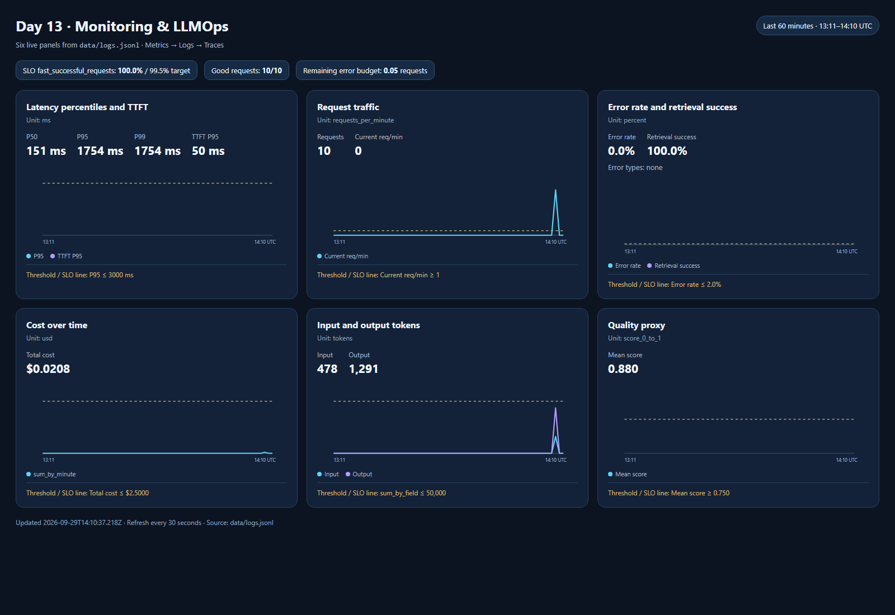
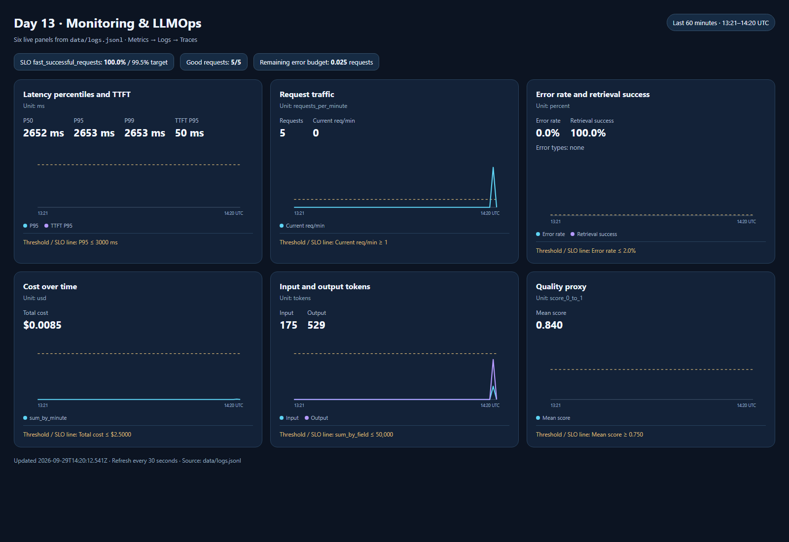
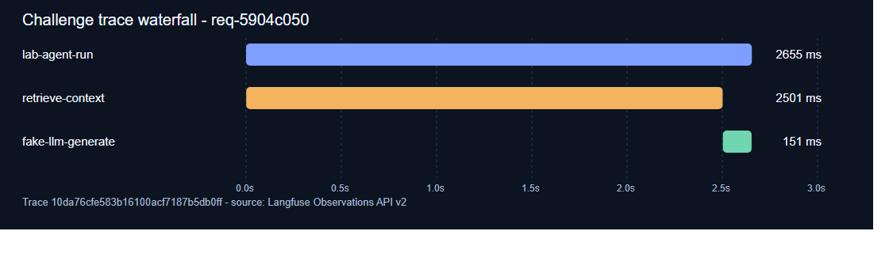

# Báo cáo cá nhân — K4-L3A Day 13 Monitoring & LLMOps

> Mỗi học viên hoàn thiện một file duy nhất này. Khi dẫn evidence, dùng đường dẫn tương đối, ví dụ [cp2-dashboard.png](evidence/cp2-dashboard.png).

## 1. Thông tin học viên

- **Họ và tên:** Nguyễn Triều Vương
- **MSSV:** 2A202602422
- **Lớp:** K4-L3A
- **Repository URL:** https://github.com/vuog23/K4-L3A-Day13-NguyenTrieuVuong-2A202602422-Monitoring-LLMOps
- **Commit SHA cuối:**
- **Challenge ID:** `day13-k4-l3a-monitoring-llmops-v1`
- **Tên project Langfuse cá nhân:** `day13-k4-l3a-2A202602422` (đã xác nhận qua API, 10 trace ID riêng biệt)

## 2. Evidence index

Điền đúng đường dẫn tới evidence thực tế. Có thể đổi tên hoặc dùng nhiều ảnh nếu cần.

| Evidence | Đường dẫn |
|---|---|
| CP0 baseline (text output) | [cp0-baseline.txt](evidence/cp0-baseline.txt) |
| CP0 Langfuse verification (text output) | [cp0-langfuse.txt](evidence/cp0-langfuse.txt) |
| CP1 validation (text output) | [cp1-validation.txt](evidence/cp1-validation.txt) |
| CP1 structured log and PII sample | [cp1-sample-log.json](evidence/cp1-sample-log.json) |
| CP2 validation | [cp2-validation.txt](evidence/cp2-validation.txt) |
| CP2 Langfuse traces | [cp2-langfuse-traces.json](evidence/cp2-langfuse-traces.json) |
| CP2 prompt labels | [cp2-prompt-labels.json](evidence/cp2-prompt-labels.json) |
| CP2 dashboard screenshot | [cp2-dashboard.png](evidence/cp2-dashboard.png) |
| CP2 dashboard data | [cp2-dashboard-data.json](evidence/cp2-dashboard-data.json) |
| CP2 workload logs | [cp2-logs.jsonl](evidence/cp2-logs.jsonl) |
| CP3 baseline and incident metrics | [cp3-baseline-dashboard.json](evidence/cp3-baseline-dashboard.json), [cp3-incident-dashboard.json](evidence/cp3-incident-dashboard.json) |
| CP3 incident dashboard screenshot | [cp3-incident-dashboard.png](evidence/cp3-incident-dashboard.png) |
| CP3 selected log lines | [cp3-selected-log.jsonl](evidence/cp3-selected-log.jsonl) |
| CP3 baseline, incident and recovery observations | [cp3-observations.json](evidence/cp3-observations.json) |
| CP3 API-derived trace waterfall | [cp3-trace-waterfall.png](evidence/cp3-trace-waterfall.png) |
| CP3 recovery metrics and health | [cp3-recovery-dashboard.json](evidence/cp3-recovery-dashboard.json), [cp3-recovery-health.json](evidence/cp3-recovery-health.json) |
| CP3 final validation | [cp3-validation.txt](evidence/cp3-validation.txt) |
| CP3 challenge integrity | [cp3-challenge-integrity.txt](evidence/cp3-challenge-integrity.txt) |
| CP4 final tests and validators | [cp4-final-checks.txt](evidence/cp4-final-checks.txt) |

## 3. Technical results

| Check | Baseline | Final result | Evidence |
|---|---:|---:|---|
| Log validator | 30/100 | 100/100; 10 recovery log records; 5 request IDs; 0 detected PII leaks | [cp3-validation.txt](evidence/cp3-validation.txt) |
| Dashboard | 6/6 YAML contract; no runtime dashboard | 6/6 contract and six populated runtime panels | [cp2-dashboard.png](evidence/cp2-dashboard.png), [cp3-validation.txt](evidence/cp3-validation.txt) |
| Pytest | 22 passed | 27 passed | [cp4-final-checks.txt](evidence/cp4-final-checks.txt) |
| Langfuse traces | 10 distinct IDs at CP0 | 10 fresh CP2 API requests matched to 10 traces; 15 CP3 baseline, incident and recovery trace trees verified | [cp2-langfuse-traces.json](evidence/cp2-langfuse-traces.json), [cp3-observations.json](evidence/cp3-observations.json) |
| Latency P95 / TTFT P95 | 151 ms / 50 ms | 2653 ms / 50 ms during the challenge; 152 ms / 50 ms after recovery | [cp3-incident-dashboard.json](evidence/cp3-incident-dashboard.json), [cp3-recovery-dashboard.json](evidence/cp3-recovery-dashboard.json) |
| Retrieval success | n/a | 100% during the measured challenge and recovery windows | [cp3-incident-dashboard.json](evidence/cp3-incident-dashboard.json) |

## 4. Logging và PII

- **Cách tạo/nhận và truyền correlation ID:** Middleware xóa context cũ ở đầu request, nhận `x-request-id` hợp lệ dạng `req-<8 hex>` hoặc sinh ID mới, bind vào structlog contextvars, truyền qua `request.state`, rồi trả `x-request-id` và `x-response-time-ms` trong response. Request mẫu nhận và trả nguyên `req-ABCDEF12`; cùng ID này xuất hiện trong log và Langfuse trace `ec2871b5d6a5f96a91375f5751b1c30c`.
- **Các metadata được ghi vào structured log:** `correlation_id`, `user_id_hash`, `session_id`, `feature`, `model`, `env`, cùng `service`, `event`, `level`, `ts`. `response_sent` còn có latency, TTFT, token, cost, quality và trạng thái retrieval.
- **Cách bảo đảm PII được scrub trước khi ghi:** Processor `scrub_event` chạy sau khi format exception và trước `JsonlFileProcessor`/`JSONRenderer`; nó duyệt các giá trị string lồng trong dict/list để thay email, điện thoại Việt Nam, CCCD và số thẻ. `user_id` được hash; metadata `session_id`/`feature` đưa vào trace cũng được scrub.
- **Cách kiểm chứng kết quả:** Log mới có 23 records, validator đạt 100/100 và báo 0 PII leak; 25 tests pass. Request mẫu chứa email/CCCD được lưu dưới dạng `[REDACTED_EMAIL]`/`[REDACTED_CCCD]`, không còn nguyên văn trong log hoặc trace. Xem [cp1-validation.txt](evidence/cp1-validation.txt) và [cp1-sample-log.json](evidence/cp1-sample-log.json).

## 5. Tracing and prompt versioning

- **Personal project and trace identity:** The Langfuse project is `day13-k4-l3a-2A202602422`. Ten fresh API request correlation IDs in [cp2-logs.jsonl](evidence/cp2-logs.jsonl) match ten distinct trace IDs in [cp2-langfuse-traces.json](evidence/cp2-langfuse-traces.json). The SDK records a hashed user ID and session ID; the API evidence omits prompt input/output and SDK key metadata.
- **Observation tree:** Each verified demo trace has an `AGENT` root `lab-agent-run` and two direct children: `RETRIEVER` `retrieve-context` and `GENERATION` `fake-llm-generate`. Generation has model `claude-sonnet-4-5`, managed prompt link, input/output token usage, and USD cost. For example, baseline trace `347a97eea1ccdad090e324ff2c744a46` has generation observation `599e535e59b233dd` with 33 input tokens, 180 output tokens, and $0.002799 estimated cost.
- **Joining a log to a trace:** Filter JSON logs on `correlation_id`, then find the same metadata field in Langfuse. The evidence JSON lists the request ID alongside its trace and child observation IDs.
- **Prompt `day13-chat`:** Version 1 uses `Feature={{feature}}`, `Docs={{docs}}`, and `Question={{message}}` and has labels `baseline` and `production`. Version 2 adds a short answer/citation instruction and has label `candidate`.
- **Same input and different versions:** The `baseline` request `req-c2a10001` used v1 in trace `347a97eea1ccdad090e324ff2c744a46`. The `candidate` request `req-c2a10004` used v2 in trace `6783b1fec5951fc43d2932858b4360e4`. Both used the same message in [scripts/cp2_trace_demo.py](../scripts/cp2_trace_demo.py).
- **Promotion and rollback:** I moved `production` to v2 and verified request `req-c2a10008` in trace `dfcc5745dedb387444f45203d756c0bf`. I then moved `production` back to v1 and verified request `req-c2a10009` in trace `1a747f5f7efd5ed1e0498d28f1c594d6`. Final label state is recorded in [cp2-prompt-labels.json](evidence/cp2-prompt-labels.json).

## 6. Dashboard, SLO, and alerts

- **Live dashboard:** `/dashboard` reads the most recent 60 minutes of `data/logs.jsonl` and refreshes every 30 seconds. Its six panels show latency P50/P95/P99 and TTFT; traffic; error rate, breakdown, and retrieval success; cost; input/output tokens; and quality proxy. Each panel displays a unit and threshold line. The runtime screenshot is [cp2-dashboard.png](evidence/cp2-dashboard.png); the underlying snapshot is [cp2-dashboard-data.json](evidence/cp2-dashboard-data.json).
- **Observed sample:** Ten requests, 0% errors, 100% retrieval success, P95 latency 1754 ms, TTFT P95 50 ms, total fake-model cost $0.020799, and mean quality proxy 0.88. The sample is a functional verification, not a 28-day SLO measurement.
- **SLO:** `fast_successful_requests` targets 99.5% over 28 days. A good request emits `response_sent` within 3000 ms. This is a user-facing threshold; the latency alert is configured to fire earlier at P95 > 1000 ms when at least 20 requests occur in five minutes.
- **Error budget:** For N requests in the SLO window, allowed bad requests are `N * (1 - 0.995) = 0.005N`. Remaining budget is allowed bad requests minus observed bad requests. For the ten-request sample this is 0.05 request; the sample has 10/10 good requests and 100% actual SLI. The fractional sample budget is shown for arithmetic transparency and is not a stand-alone operational budget.
- **Symptom alerts:** `high_tail_latency` (warning, 5m), `elevated_errors_or_retrieval_failures` (critical, 5m), and `unexpected_llm_spend` (warning, 10m) each define a condition, owner, Slack target `#llmops-alerts`, and runbook in [config/alert_rules.yaml](../config/alert_rules.yaml) and [docs/alerts.md](../docs/alerts.md). The configuration names a notification destination; this lab app does not send Slack messages.

## 7. Challenge investigation

- **Challenge ID and input:** `day13-k4-l3a-monitoring-llmops-v1`, cohort K4, affected feature `monitoring`, five released queries, incident `rag_slow`, challenge latency threshold 2000 ms. I copied the supplied file byte-for-byte to ignored `config/challenge.json`; I did not edit or commit its contents.
- **Time window and metric:** On 2026-09-29, the incident requests ran around 14:19:33-14:19:46 UTC. With the same five challenge queries before injection, latency P50/P95 was 151/1668 ms. During the incident it was 2652/2653 ms, and all five API `latency_ms` values exceeded the challenge's 2000 ms threshold. TTFT P95 stayed 50 ms and all responses were HTTP 200. The metric screenshot is [cp3-incident-dashboard.png](evidence/cp3-incident-dashboard.png); baseline and incident JSON snapshots are indexed above.
- **Log line and correlation ID:** In [cp3-selected-log.jsonl](evidence/cp3-selected-log.jsonl), `req-5904c050` has `request_received` at 14:19:36.106911 UTC and `response_sent` at 14:19:38.764065 UTC. The response line records `latency_ms=2653`, `ttft_ms=50`, `feature=monitoring`, `tool_success=true`, and no HTTP error. The exported incident log is [cp3-incident-logs.jsonl](evidence/cp3-incident-logs.jsonl); private challenge query previews and session identifiers were removed from these evidence copies. The ignored local runtime log remains available for checking.
- **Trace and slow span:** The same correlation ID maps to Langfuse trace `10da76cfe583b16100acf7187b5db0ff`. Its root `lab-agent-run` lasted 2.655 s; child retriever `retrieve-context` (`d190d35005b78e43`) lasted 2.501 s; child generation `fake-llm-generate` (`c0f0dbc356b3f23d`) lasted 0.151 s. All three incident observations have Langfuse level `DEFAULT` with no error status message; retrieval reports success. A baseline retriever lasted about 0.001 s. The timings and parent IDs are in [cp3-observations.json](evidence/cp3-observations.json); [cp3-trace-waterfall.png](evidence/cp3-trace-waterfall.png) is a visual generated from those API observations, rather than a screenshot of the Langfuse website.
- **Root cause:** The challenge enables `rag_slow`, which makes the mock retrieval call sleep for 2.5 s. That blocking call runs inside the async `/chat` handler, so five concurrent clients took about 13.3 s each end to end as requests queued. The retriever span accounts for nearly all of the 2.65 s server time per request; generation and TTFT stayed stable.
- **Fix and verification:** I disabled the injected incident using `python scripts/inject_incident.py --disable` and repeated the same five-query workload. Recovery P50/P95 was 151/152 ms, the retriever spans rounded to less than 1 ms, and all requests returned HTTP 200; see [cp3-recovery-dashboard.json](evidence/cp3-recovery-dashboard.json) and [cp3-recovery-logs.jsonl](evidence/cp3-recovery-logs.jsonl). The production fix would also move blocking retrieval work off the event loop and enforce a retrieval timeout or fallback.
- **Preventive measure:** Track retrieval-child duration and API P95 together, join slow logs to traces with `correlation_id`, and alert on sustained high latency. The five-request challenge did not meet the current latency alert's minimum of 20 requests per five minutes. The dashboard's 3000 ms SLO also remained green because it uses a different threshold from the challenge's 2000 ms criterion; both thresholds should be reviewed for low-traffic incidents.

## 8. Explanation and self-assessment

- **Technical decision:** I place the PII scrubber before both the JSON file writer and renderer, and trace only safe summaries and hashed user IDs. This lets a log ID join to a Langfuse trace without storing a raw prompt or user identifier.
- **Blocker:** Langfuse prompt fetch/export intermittently timed out during CP2. I increased the prompt fetch timeout, retried the same controlled input, and verified each prompt label/version from the Langfuse API and exported trace metadata. A nested copy of the lab also caused pytest import-name collisions; `pytest.ini` now limits collection to this repo's `tests/` directory.
- **How I investigated:** The challenge dashboard located the 14:19 UTC latency increase. A `response_sent` log identified `req-5904c050`; its Langfuse trace showed 2.501 s in retrieval and 0.151 s in generation. Disabling `rag_slow` and rerunning the same queries reduced P95 to 152 ms.
- **Metrics, logs, and traces:** Metrics establish the affected time and scale; logs identify a specific request and its correlation ID; the trace reveals which child operation consumed the time. HTTP 200 alone would have missed the slowdown.
- **Operational role of prompt, tokens, cost, and SLO:** Prompt labels make a v2 promotion and v1 rollback traceable. Generation token and cost data make spend changes visible. The 28-day SLO and error budget express an availability target, while the 2000 ms challenge threshold revealed an issue that the configured 3000 ms SLO still considered good.
- **Main lesson:** Record one consistent correlation ID across all three signals and compare child span durations before choosing a fix.
- **Limits:** The model and cost are simulated. Five challenge requests do not measure a 28-day SLO or satisfy the current alert's 20-request minimum. The API-derived trace visualization is labelled as such; authenticated Langfuse website screenshots are still needed if the grading rubric requires them.

## 9. Submission checklist

- [x] Confirm full name: Nguyễn Triều Vương.
- [ ] Use the required personal repository name `K4-L3-DAY13-NguyenTrieuVuong-2A202602422-Monitoring-LLMOps`, update its URL, and record the final submitted SHA.
- [x] Every linked local evidence file opens through a relative report path.
- [x] Incident metric, log correlation ID, and trace identify the same slowdown.
- [ ] Add authenticated Langfuse project screenshots for trace list, observation metadata, prompt versions, and rollback.
- [x] Source runs by the README commands; 27 tests and both validators pass.
- [x] The evidence scan found no Langfuse key, raw PII, or private challenge query values; `.env` and the challenge file are ignored.
- [ ] Commit the complete evidence set, verify it on GitHub, and submit the personal repository URL and final SHA on VLearn.
